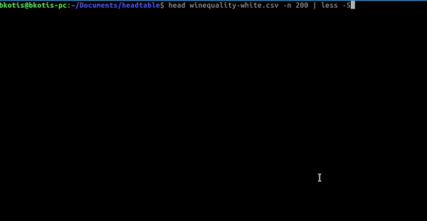

# headtable

[](https://github.com/wickdchromosome/headtable/issues)

[](https://opensource.org/licenses/MIT)

<div style="text-align:center"></div>


This is a quick and dirty command line utility to display the head of a file, padded as a table - most useful when piped into less:
```
./headtable test.csv | less -S
```
This displays a padded, scrollable table in your terminal of 10 lines from a csv file.

To do this for 200 lines:
```
./headtable test.csv 200 | less -S
```

Your output will look something like this:
```
gene_id          nvar    b_shape1    b_shape2  
ENSG000002272    1364    1.093       294.4
ENSG000002699    1868    1.093       358.2
ENSG000002418    2066    1.093       383.2
ENSG000002419    2066    1.093       396.2
ENSG000002792    2234    1.093       412.3
ENSG000002791    2234    1.093       408.3
ENSG000002288    2799    1.093       511.3
ENSG000002283    2799    1.093       452.4
ENSG000002289    2799    1.093       490.6

```

Currently there is support for comma, semicolon and tab separators, which are automatically deduced 
from the input file.

## Compilation

### Dependencies
This project depends on Boost, C++11 and gcc.
On debian, you can get the deps by doing:
```
sudo apt install gcc libboost1.67-dev
```


### Now compile

```
bash compile.sh
```

### Install the binary system-wide

```
sudo bash install.sh
```
